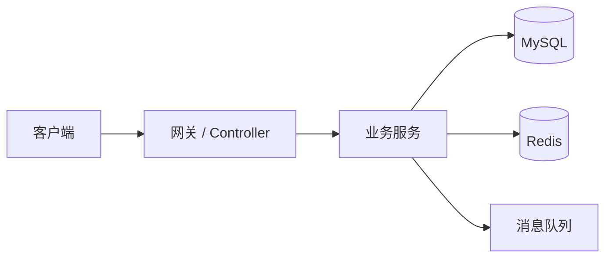

# Java 后端项目 README 模板

> 复制本模板到你的项目仓库，根据真实情况填写。不要写没有实现或无法解释的能力。

## 项目简介

- 项目名称：
- 目标用户：
- 解决问题：
- 我的角色：
- 技术栈：

## 核心功能

| 功能 | 说明 | 我负责的部分 |
| --- | --- | --- |
|  |  |  |

## 架构设计



## 数据模型

| 表 | 作用 | 关键字段 |
| --- | --- | --- |
|  |  |  |

## 技术亮点

| 亮点 | 为什么需要 | 方案 | 效果 |
| --- | --- | --- | --- |
| 幂等 |  |  |  |
| 缓存 |  |  |  |
| 异步 |  |  |  |
| 限流 |  |  |  |

## 问题复盘

| 问题 | 定位过程 | 解决方案 | 后续改进 |
| --- | --- | --- | --- |
|  |  |  |  |

## 面试追问准备

1. 为什么这样拆模块？
2. 数据一致性如何保证？
3. 缓存和数据库不一致怎么办？
4. 如何做压测？
5. 如果流量扩大 10 倍怎么改？

## 简历写法

```text
基于【技术栈】实现【项目 / 模块】，负责【你的职责】；
针对【问题】设计【方案】，通过【指标 / 验证方式】证明效果。
```
