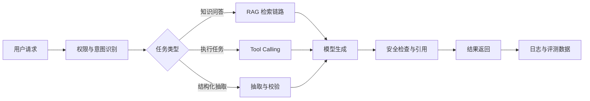

# AI 应用研发作品集项目清单：别只做一个聊天框

AI 应用研发岗位不缺“调用大模型 API”的候选人，缺的是能把模型接入真实业务流程、能评测、能降级、能处理权限和数据边界的人。

一个好的 AI 应用作品集，应该证明你理解三件事：

1. 模型不是系统，模型只是系统的一部分。
2. AI 应用必须有评测和可观测，否则无法稳定迭代。
3. 数据权限、引用来源和失败兜底比炫酷 Demo 更重要。

## 一、作品集项目分层

| 层级 | 项目 | 证明能力 |
| --- | --- | --- |
| 入门 | RAG 知识库问答 | 文档处理、向量检索、引用、低置信度兜底 |
| 进阶 | Agent 工具调用平台 | 工具协议、参数校验、权限确认、任务编排 |
| 工程化 | AI 应用评测平台 | 测试集、自动评测、回归对比、错误归因 |
| 业务型 | 简历/合同/客服审核系统 | 业务规则、结构化抽取、人机协同 |
| 基础设施 | Prompt 与配置管理平台 | 版本管理、灰度、效果对比、审计 |

## 二、推荐项目清单

| 项目 | 核心模块 | 面试亮点 |
| --- | --- | --- |
| RAG 课程资料问答 | 文档解析、切分、Embedding、召回、重排、引用 | 能讲清召回失败、幻觉和评测 |
| 简历智能评估系统 | 简历解析、岗位匹配、证据抽取、修改建议 | 和求职场景结合强 |
| Agent 求职助手 | 工具调用、投递表更新、面试复盘生成 | 能讲工具权限和确认机制 |
| AI 客服质检 | 对话分类、违规检测、评分规则、人工复核 | 能讲业务规则和准确率 |
| Prompt 评测平台 | 测试集、批量运行、指标对比、版本回滚 | 工程化价值高 |
| 合同条款审查 | 条款抽取、风险分类、引用来源、人工确认 | 强调安全和责任边界 |
| 代码 Review 助手 | Diff 解析、规则检查、建议生成、误报反馈 | 适合开发者画像 |

## 三、作品集最低要求

| 能力 | 最低实现 |
| --- | --- |
| 数据输入 | 支持上传文档或接入结构化数据 |
| 检索/工具 | 至少有 RAG 或 Tool Calling |
| 引用来源 | 回答能返回出处或执行记录 |
| 评测 | 至少 30-50 条测试集 |
| 失败兜底 | 低置信度时拒答或转人工 |
| 日志 | 记录输入、检索结果、模型输出、耗时 |
| 权限 | 区分用户可访问数据范围 |

## 四、AI 项目架构模板



## 五、AI 项目简历写法

普通写法：

```text
基于大模型实现智能问答系统。
```

更好的写法：

```text
基于 RAG 构建课程资料问答系统，完成 PDF 解析、文本切分、向量召回、TopK 重排和引用展示，
建立 50 条问答测试集评估可引用率，并对低置信度问题返回“资料中未找到依据”以降低幻觉风险。
```

## 六、面试追问准备

| 问题 | 要点 |
| --- | --- |
| 为什么需要 RAG？ | 私有知识、时效性、可引用、降低幻觉 |
| chunk size 怎么定？ | 文档结构、语义完整性、召回效果、评测对比 |
| 召回不准怎么办？ | Query 改写、重排、多路召回、测试集分析 |
| 怎么评测效果？ | 准确率、可引用率、拒答率、人工标注 |
| 如何处理敏感数据？ | 脱敏、权限过滤、日志保护、最小必要上下文 |
| Agent 调错工具怎么办？ | 参数校验、权限确认、dry-run、审计 |

## 行动清单

- [ ] 至少完成一个 RAG 项目。
- [ ] 准备 30-50 条测试集。
- [ ] 记录检索结果、模型输出和失败案例。
- [ ] 简历中写清评测指标，不只写“接入大模型”。

延伸阅读：[AI 应用研发工程师求职专题](../AI应用研发/README.md) · [RAG 从检索到评测](../AI应用研发/03-RAG从检索到评测.md)
