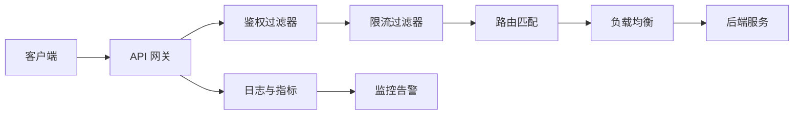

# API 网关项目拆解：鉴权、限流、路由和可观测

API 网关项目适合展示工程抽象能力。它不只是请求转发，而是统一处理鉴权、限流、路由、灰度、日志和监控。

## 一、业务场景

多个后端服务对外提供 API。网关作为统一入口，负责：

1. 请求鉴权。
2. 路由转发。
3. 限流熔断。
4. 日志与监控。
5. 灰度发布。

## 二、架构图



## 三、核心设计

| 模块 | 方案 |
| --- | --- |
| 鉴权 | JWT、签名校验、AK/SK |
| 路由 | path、method、header 匹配 |
| 限流 | 令牌桶、滑动窗口、用户级限流 |
| 熔断 | 下游异常率高时快速失败 |
| 灰度 | 按用户、Header、比例路由 |
| 可观测 | 请求日志、耗时、状态码、trace_id |

## 四、技术亮点

1. 责任链模式组织过滤器，便于扩展。
2. 支持动态路由配置，避免重启生效。
3. 使用 Redis 实现分布式限流。
4. 统一生成 trace_id，串联上下游日志。
5. 支持按 Header 或用户 ID 灰度路由。

## 五、常见追问

| 问题 | 回答方向 |
| --- | --- |
| 网关和 Nginx 有什么区别？ | Nginx 偏通用代理，业务网关处理鉴权、限流、灰度 |
| 限流算法怎么选？ | 固定窗口简单但有边界突刺，令牌桶更平滑 |
| 动态路由怎么实现？ | 配置中心、监听变更、本地缓存 |
| 网关挂了怎么办？ | 多实例、负载均衡、健康检查 |
| 如何排查慢请求？ | trace_id、耗时日志、下游状态码 |
| 灰度出问题如何回滚？ | 配置开关、快速切回稳定版本 |

## 六、简历写法

```text
设计统一 API 网关，基于责任链模式实现鉴权、限流、路由和日志过滤器；
支持 Redis 分布式限流、动态路由配置和 trace_id 链路追踪，统一沉淀接口耗时、状态码和异常日志。
```
