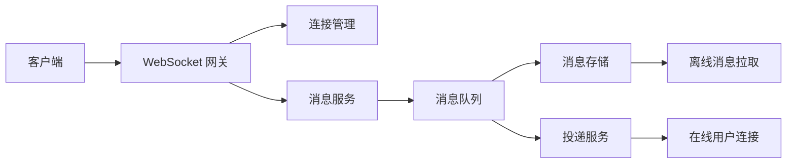

# IM 系统项目拆解：连接管理、消息投递和离线消息

IM/聊天室项目适合展示网络通信、状态管理和消息可靠性。校招不要求你做出微信，但要讲清楚连接、投递、存储和异常处理。

## 一、业务场景

支持用户登录后发送单聊消息，在线用户实时收到，离线用户上线后拉取历史消息。

## 二、架构图



## 三、核心设计

| 模块 | 方案 |
| --- | --- |
| 连接管理 | user_id 到 channel/session 的映射 |
| 心跳 | 客户端定期心跳，服务端清理失效连接 |
| 消息 ID | 雪花 ID 或数据库 ID 保证顺序依据 |
| 消息存储 | MySQL/NoSQL 存储会话消息 |
| 投递 | 在线直接推送，离线保存后拉取 |
| ACK | 客户端确认收到，失败可重试 |

## 四、技术亮点

1. WebSocket 长连接管理在线状态。
2. 消息先落库或进入 MQ，避免服务宕机丢消息。
3. 客户端 ACK 确认投递结果。
4. 离线消息按会话和消息 ID 分页拉取。
5. 心跳检测清理异常断开的连接。

## 五、常见追问

| 问题 | 回答方向 |
| --- | --- |
| 如何判断用户在线？ | 连接表、心跳、过期清理 |
| 消息会不会丢？ | MQ/落库、ACK、重试 |
| 如何保证消息顺序？ | 单会话内递增消息 ID，客户端按 ID 排序 |
| 离线消息怎么拉？ | 按 last_msg_id 增量拉取 |
| 多端登录怎么办？ | user_id 对应多个设备连接 |
| 服务扩容后连接在哪台机器？ | 连接路由表或网关层转发 |

## 六、简历写法

```text
实现基于 WebSocket 的单聊消息系统，设计连接管理、心跳检测、在线投递和离线消息拉取；
通过消息 ID 和客户端 ACK 处理消息顺序与投递确认，并支持用户上线后按 last_msg_id 增量同步历史消息。
```
