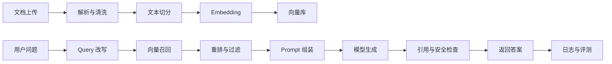
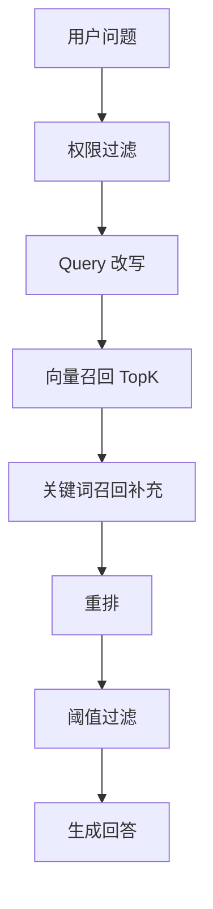

# RAG 项目从 0 到 1：做一个能面试的知识库问答系统

RAG 项目适合 AI 应用研发求职，但前提是不能只做“上传文档，然后问答”。面试官真正关心的是：你怎么切分文档，怎么召回，怎么评测，怎么处理回答错误，怎么保证权限和引用。

## 一、项目目标

做一个课程资料/企业文档知识库问答系统，支持：

1. 上传 PDF、Markdown、TXT 文档。
2. 文档解析、清洗、切分和向量化。
3. 用户提问后召回相关片段。
4. 模型基于片段生成回答，并展示引用来源。
5. 对低置信度问题拒答。
6. 记录检索、生成、耗时和用户反馈。

## 二、整体架构



## 三、技术选型

| 模块 | 可选方案 | 面试要点 |
| --- | --- | --- |
| 后端 | Spring Boot / FastAPI | 项目语言不重要，链路要清楚 |
| 文档解析 | pdfplumber、PyMuPDF、Apache Tika | 表格、标题、页码处理 |
| 向量库 | Chroma、Milvus、pgvector、Elasticsearch | 数据量、部署成本、过滤能力 |
| Embedding | 通用 embedding 模型 | 维度、成本、中文效果 |
| 重排 | Cross Encoder / LLM rerank | 提升精度但增加延迟 |
| 评测 | 自建测试集 + 人工标注 | 可引用率、拒答率、召回率 |

## 四、核心实现步骤

### 1. 文档解析

保留这些元信息：

| 字段 | 用途 |
| --- | --- |
| doc_id | 文档唯一标识 |
| title | 文档标题 |
| page | 页码 |
| section | 章节 |
| content | 文本内容 |
| acl | 权限范围 |

### 2. 文本切分

不要只按固定字数切分。更好的顺序：

1. 先按标题、段落、列表切分。
2. 再控制 chunk 长度。
3. 保留 overlap，避免上下文断裂。
4. 每个 chunk 带上文档标题和章节信息。

### 3. 检索链路



### 4. 低置信度兜底

如果召回片段得分低、来源冲突、没有直接证据，应拒答：

```text
当前资料中没有找到足够依据回答该问题。
建议补充相关文档，或换一种更具体的问题描述。
```

## 五、评测设计

至少准备 50 条测试问题。

| 类型 | 示例 | 评测重点 |
| --- | --- | --- |
| 事实问答 | 课程作业截止时间是什么？ | 是否找到正确来源 |
| 多跳问题 | 先修要求和考核方式有什么关系？ | 是否整合多个片段 |
| 无答案问题 | 老师手机号是多少？ | 是否拒答 |
| 相似概念 | 召回率和准确率有什么区别？ | 是否混淆 |
| 权限问题 | 询问无权限文档内容 | 是否被过滤 |

指标：

| 指标 | 含义 |
| --- | --- |
| Recall@K | 正确片段是否被召回 |
| 可引用率 | 回答是否包含有效来源 |
| 幻觉率 | 没依据却回答的比例 |
| 拒答准确率 | 无答案问题是否拒答 |
| 平均延迟 | 检索和生成总耗时 |

## 六、面试亮点

| 亮点 | 说明 |
| --- | --- |
| 引用来源 | 回答不是黑盒，有出处 |
| 低置信度拒答 | 不强行生成 |
| 权限过滤 | 用户只能检索自己有权访问的文档 |
| 测试集评测 | 不靠主观感觉判断效果 |
| 失败案例分析 | 能讲召回失败和幻觉原因 |

## 七、面试追问

| 问题 | 回答方向 |
| --- | --- |
| chunk size 怎么选？ | 通过测试集比较召回率和答案完整性 |
| 为什么需要 rerank？ | 向量召回粗排，rerank 提升相关性 |
| 如果答案编造怎么办？ | 引用约束、阈值过滤、拒答、评测 |
| 如何做权限控制？ | 检索前按 ACL 过滤，不把无权限 chunk 放入上下文 |
| 如何优化延迟？ | 缓存 embedding、减少 TopK、异步日志、流式输出 |

## 八、简历写法

```text
基于 RAG 构建课程资料知识库问答系统，完成 PDF 解析、结构化切分、向量召回、TopK 重排和引用展示；
设计 50 条测试集评估 Recall@K、可引用率和拒答准确率，并对低置信度问题增加拒答策略，降低无依据回答。
```
