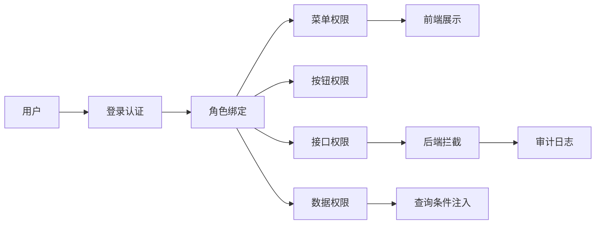

# 权限系统项目拆解：RBAC、数据权限和审计

权限系统适合银行、国企、后台系统和中台类岗位。它看似普通，但能体现安全意识、业务建模和工程边界。

## 一、业务场景

后台管理系统需要控制不同用户能访问哪些菜单、按钮、接口和数据范围。

## 二、架构图



## 三、核心模型

| 表 | 作用 |
| --- | --- |
| user | 用户 |
| role | 角色 |
| permission | 权限点 |
| user_role | 用户角色关系 |
| role_permission | 角色权限关系 |
| org | 组织架构 |
| audit_log | 操作审计 |

## 四、权限层次

| 层次 | 示例 |
| --- | --- |
| 菜单权限 | 是否能看到“用户管理” |
| 按钮权限 | 是否能点击“删除用户” |
| 接口权限 | 是否能调用 DELETE /users |
| 数据权限 | 只能看本部门或本人数据 |

只做菜单权限不够，真正关键的是后端接口权限和数据权限。

## 五、技术亮点

1. RBAC 模型实现用户、角色、权限解耦。
2. 前端根据权限点控制菜单和按钮展示。
3. 后端使用拦截器/注解进行接口鉴权。
4. 数据权限根据组织范围动态追加查询条件。
5. 关键操作写审计日志，便于追溯。

## 六、常见追问

| 问题 | 回答方向 |
| --- | --- |
| RBAC 是什么？ | 用户-角色-权限三层模型 |
| 前端隐藏按钮够不够？ | 不够，后端必须鉴权 |
| 数据权限怎么做？ | 根据用户组织范围追加查询条件 |
| 权限变更如何生效？ | 缓存失效、版本号、重新加载 |
| 超级管理员怎么处理？ | 特殊角色但仍保留审计 |
| 如何防止越权？ | 接口鉴权、数据过滤、审计日志 |

## 七、简历写法

```text
设计后台管理系统 RBAC 权限模块，完成用户、角色、权限点和组织架构建模；
通过后端拦截器实现接口级鉴权，并基于组织范围实现数据权限过滤，同时记录关键操作审计日志。
```
