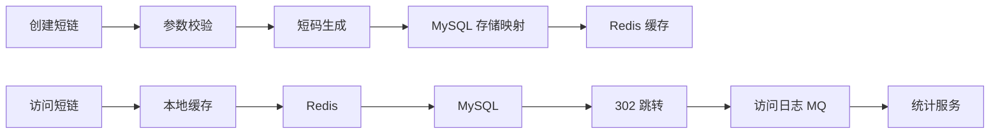

# 短链系统项目拆解：看似简单，适合讲系统设计

短链系统适合校招简历，因为业务简单，但可以讲出编码算法、缓存、跳转性能、统计分析、防刷和数据一致性。

## 一、业务场景

用户输入长链接，系统生成短链接。访问短链接时，系统跳转到原始地址，并记录访问数据。

核心问题：

1. 短码如何生成，避免冲突。
2. 跳转链路如何低延迟。
3. 热点短链如何缓存。
4. 访问统计如何异步处理。
5. 恶意链接和刷量如何控制。

## 二、架构图



## 三、核心设计

| 模块 | 方案 |
| --- | --- |
| 短码生成 | 自增 ID + Base62，或 Snowflake + Base62 |
| 防冲突 | 数据库唯一索引兜底 |
| 跳转 | 302 临时重定向，便于统计 |
| 缓存 | 本地缓存 + Redis 缓存热点映射 |
| 统计 | MQ 异步写访问日志 |
| 安全 | 黑名单、域名校验、访问频控 |

## 四、技术亮点

1. 使用 Base62 压缩 ID，生成短且可读的短码。
2. 跳转链路优先读本地缓存和 Redis，降低数据库访问。
3. 对不存在短码缓存空值，防止缓存穿透。
4. 访问日志通过 MQ 异步处理，避免影响跳转耗时。
5. 对恶意域名和高频访问增加校验与限流。

## 五、常见追问

| 问题 | 回答方向 |
| --- | --- |
| 为什么不用随机字符串？ | 随机需要处理冲突，自增 ID + Base62 更可控 |
| 301 还是 302？ | 302 便于统计和变更目标，301 会被浏览器缓存 |
| 热点短链怎么办？ | 本地缓存、Redis、过期刷新 |
| 不存在的短码被频繁访问怎么办？ | 缓存空值、布隆过滤器、限流 |
| 访问统计怎么做？ | 异步写日志，按时间、地区、来源聚合 |
| 如何防止恶意链接？ | 域名黑名单、安全检测、人工审核 |

## 六、简历写法

```text
实现短链生成与跳转系统，采用自增 ID + Base62 生成短码，并使用唯一索引兜底冲突；
跳转链路引入本地缓存和 Redis 缓存热点映射，访问日志通过 MQ 异步统计，降低跳转接口延迟。
```
