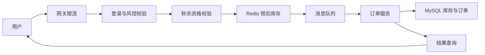

# 秒杀系统项目拆解：高并发、库存一致性和削峰

秒杀系统是后端校招常见项目。它的价值不在“抢购页面”，而在高并发下如何保护系统、控制库存、保证幂等和处理异步链路。

## 一、业务场景

用户在固定时间抢购限量商品。系统要解决：

1. 瞬时流量远高于平时。
2. 库存不能超卖。
3. 用户不能重复下单。
4. 下单链路不能拖垮数据库。
5. 失败和超时要有明确结果。

## 二、架构图



## 三、核心设计

| 模块 | 方案 | 关键点 |
| --- | --- | --- |
| 限流 | 网关限流、用户级限流、接口限流 | 保护下游服务 |
| 库存 | Redis 预扣 + DB 最终扣减 | 避免直接打数据库 |
| 幂等 | 用户 + 活动 + 商品唯一约束 | 防重复下单 |
| 削峰 | MQ 异步创建订单 | 平滑写入压力 |
| 结果查询 | 下单后返回排队中，用户轮询结果 | 避免同步等待 |
| 兜底 | 超时补偿、失败回滚库存 | 保证最终一致 |

## 四、技术亮点

1. 使用 Redis Lua 脚本保证库存扣减和重复校验的原子性。
2. 通过 MQ 异步创建订单，削减瞬时数据库写压力。
3. MySQL 使用唯一索引兜底，防止同一用户重复下单。
4. 订单状态设计为 `INIT / SUCCESS / FAILED / TIMEOUT`，便于结果查询和补偿。
5. 通过压测观察 QPS、P95 延迟、库存一致性和消息堆积。

## 五、常见追问

| 问题 | 回答方向 |
| --- | --- |
| Redis 扣了库存，订单创建失败怎么办？ | 消费失败重试，最终失败回补库存，记录状态 |
| 为什么不用数据库直接扣库存？ | 高并发下 DB 压力大，Redis 预扣用于削峰 |
| MQ 消息重复消费怎么办？ | 订单唯一键、幂等表、消费状态 |
| 如何防止用户重复请求？ | 用户维度限流、幂等 token、唯一索引 |
| Redis 挂了怎么办？ | 降级关闭活动、只读结果、保护数据库 |
| 如何压测？ | 模拟并发请求，检查成功数、库存、延迟、错误率 |

## 六、简历写法

```text
设计秒杀下单链路，通过网关限流、Redis Lua 原子预扣库存和 MQ 异步创建订单削峰；
使用用户维度唯一约束保证幂等，并设计失败补偿任务回补库存，压测验证高并发下库存无超卖。
```

## 七、项目风险

| 风险 | 处理 |
| --- | --- |
| 只会说 Redis + MQ | 必须讲清异常和补偿 |
| 没压测数据 | 至少用 JMeter/脚本做模拟 |
| 没有状态机 | 订单结果无法解释 |
| 忽略幂等 | 面试很容易被打穿 |
