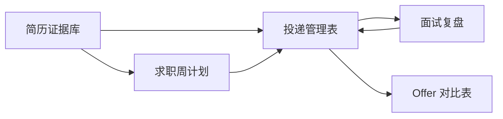

# 求职工具模板

这个目录放的是可以直接复制使用的求职模板。建议把它们当成个人求职工作台，而不是读完就收藏的资料。

| 模板 | 解决的问题 | 建议使用频率 |
| --- | --- | --- |
| [简历证据库模板](./简历证据库模板.md) | 把经历拆成可验证事实，再转成简历 bullet | 写简历前、每次项目迭代后 |
| [投递管理表模板](./投递管理表模板.md) | 记录公司、岗位、简历版本、流程状态和反馈 | 每天更新 |
| [面试复盘模板](./面试复盘模板.md) | 把面试问题、卡点、追问和改进行动沉淀下来 | 每次面试后 24 小时内 |
| [Offer 对比表模板](./Offer对比表模板.md) | 用权重比较薪资、成长、稳定性和风险 | 拿到 offer 后 |
| [Markdown 版求职周计划](./求职周计划模板.md) | 按周管理学习、投递、面试和复盘节奏 | 每周固定一次 |

## 推荐使用顺序

## 使用原则

1. 先填事实，再写结论。
2. 每次只优化三件事，避免复盘后产生过多待办。
3. 所有“我觉得”都尽量变成数据、截图、代码、链接、反馈记录。
4. 简历、投递、面试和 offer 决策要能互相对上，不能各写各的。
